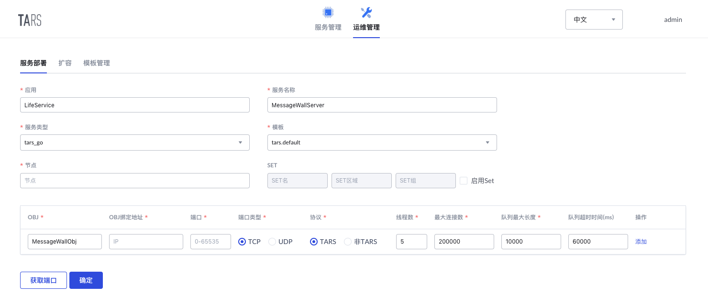

# MessageWallServer
[English Version](README_en.md)

大学生活服务平台表白墙后端服务，提供表白发布，表白墙留言获取功能。

服务接口可查看[接口文档](docs/RPC.md)

## 项目结构
```sh
MessageWallServer
├── client              # 默认自动生成的客户端代码
│   ├── client.go
│   └── CMakeLists.txt
├── CMakeLists.txt      # 项目构建makefile文件
├── config.conf         # 默认配置文件
├── debugtool
│   └── dumpstack.go    # 默认自动生成的debug代码
├── docs                # 文档资源
├── go.mod              # Go modules 文件
├── go.sum
├── README.md
├── start.sh            # 默认启动脚本
├── main.go             # 服务实现文件
├── messagewall_imp.go  # 接口实现文件
├── MessageWall.tars    # 表白墙服务tars文件
├── DataService.tars    # 数据服务tars文件
└── tars-protocol
    └── LifeService     # tars协议文件生成的go代码
```

## 开发环境
* Go >= `1.13.x`, 参照 [Go 官网安装文档](https://golang.org/doc/install)即可
* TarsGo, 参照[TarsGo文档](https://github.com/TarsCloud/TarsGo/blob/master/README.zh.md#%E5%AE%89%E8%A3%85)中的步骤，安装 TarsGo 即可

## 构建方式

我们将项目 clone 到任意目录下

```sh
git clone https://github.com/TarsDemo/Tars-MiniProgramm-Service-MessageWallServer.git MessageWallServer
```

进入项目目录, 生成服务发布包，执行下面命令即可生成发布包

```sh
cd MessageWallServer
mkdir build
cd build
cmake ..
make 
make MessageWallServer-tar
```

## 服务部署
### 部署信息
在 `Tars平台->运维管理->服务部署` 中，按如下信息部署服务，其中节点填写自己需要部署服务的节点

* 服务基本信息：
    * 应用名称：`LifeService`
    * 服务名称：`MessageWallServer`
    * 服务类型：`tars_go`
    * 模板名称：`tars.go.default`
* Obj部署信息：
    * OBJ名称：`MessageWallObj`
    * 协议类型：`TARS`
    * 端口：自动生成



### 服务发布
在 `TarsWeb 平台->服务管理->LifeService->MessageWallServer->发布管理` 中，
* 选中刚刚部署的节点，点击 `发布选中节点`
* 上传发布包，选中构建项目生成的发布包 `MessageWallServer.tgz` 上传
* 在发布版本中便可以找到刚刚上传的发布包并选择
* 点击 `发布` 即可完成发布