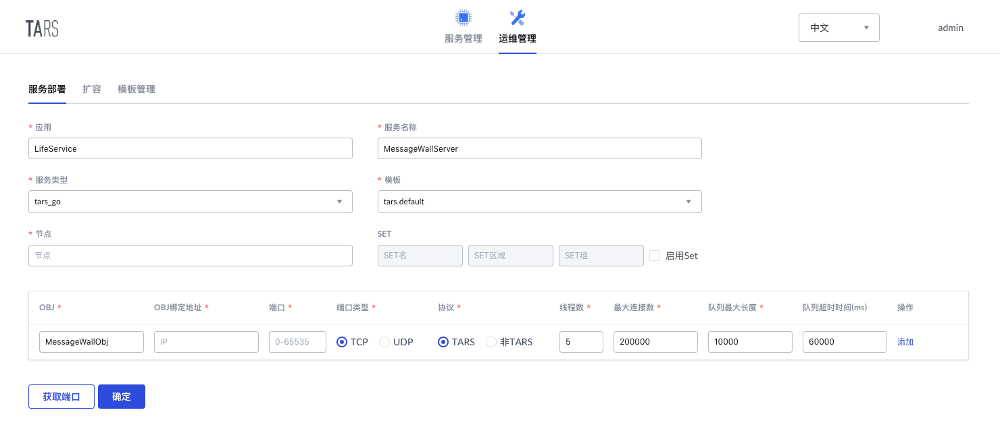

# MessageWallServer

MessageWallServer if one of the backend service of miniprogram LifeService, which can publish your love message.

For server interface, see [API Document](docs/RPC.md)

## 项目结构
```sh
MessageWallServer
├── client                  # Auto-gen client code
│   ├── client.go
│   └── CMakeLists.txt
├── CMakeLists.txt          # CMake file
├── config.conf             # Default config file [Auto gen]
├── debugtool
│   └── dumpstack.go        # Auto-gen debug code
├── docs                    # docs source file
├── go.mod                  # Go modules file
├── go.sum
├── README.md
├── start.sh                # Start script [Auto gen]
├── main.go                 # Implement of server
├── messagewall_imp.go  # Implement of interface
├── MessageWall.tars    # tars file of MessageWallServer
├── DataService.tars    # tars file of DataServer
└── tars-protocol
    └── LifeService     # tars protocol golang code generated by tars file
```

## Development Environment

* Go >= `1.13.x`, see [Go Installation Document](https://golang.org/doc/install).
* TarsGo, See [TarsGo Installation Document](https://github.com/TarsCloud/TarsGo#Install).

## Build

Clone this project

```sh
git clone https://github.com/TarsDemo/Tars-MiniProgramm-Service-MessageWallServer.git MessageWallServer
```

Get into the path of this project and generate the package by the following command

```sh
cd MessageWallServer
mkdir build
cd build
cmake ..
make 
make MessageWallServer-tar
```

## Server Deployment

### Deployment Configuration

Go to `TarsWeb->Operation->Deploy service`, and deploy the service according to the following configuration.

* Service info：
    * APP: `LifeService`
    * Service name: `MessageWallServer`
    * Service type: `tars_go`
    * Template: `tars.go.default`
    * Node: The node that you want to deploy the service.
* Obj info：
    * OBJ: `MessageWallObj`
    * Protocol: TARS
    * Port: Auto-gen



### Publish Service

Go to `TarsWeb->Services->LifeService->DataServer->Publish`, and

* Choose the node which you just deploy and click `publish node`.
* click `upload release package` and choose the package you just built to upload.
* Select the version you just uploaded in the `release version` list.
* Click `publish` and finish.